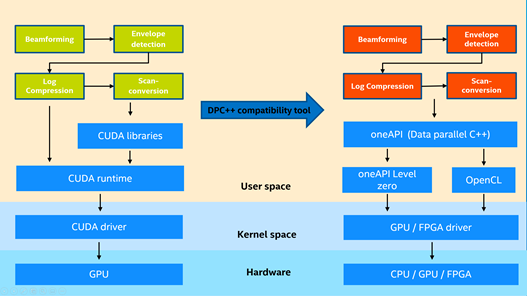
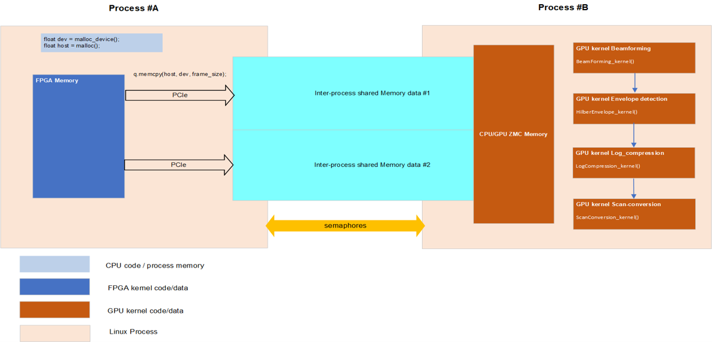

# oneAPI-Ultrasound-Beamforming-Library

This project contains 2 ultrasound software beamforming samples, which process ultrasound raw data into images human readable. The project use Intel oneAPI to do computation acceleration with Intel GPU and FPGA. The functions are developed based on Supra(https://github.com/IFL-CAMP/supra).

Using oneAPI toolkit -- Intel® DPC++ Compatibility Tool to implement the migration from CUDA to standard DPC++ has been released. For more details, please refer to: https://github.com/intel/supra-on-oneapi. The purpose of this project is for extracting and rewriting the kernel code for easily utilization and running on Intel xPU devices.

## 1. Host Development System

The preferred (and tested) development host platform is PC with Ubuntu 18.04. The PC could have a graphics processor, a discrete graphics card, or an Intel FPGA. 

Intel CPU with Intel integrated and discrete GPU, and Intel FPGA as optional to be data producer. If FPGA is used to produce data for GPU, please install additional package for usage of FPGA. Please choose the version following your FPGA model type and refer to https://www.intel.com/content/www/us/en/developer/articles/release-notes/intel-oneapi-dpcpp-fpga-add-on-release-notes.html.

Also, Devcloud for OneAPI can be used for testing. Please refer to  https://devcloud.intel.com/oneapi.

This project has been tested on Intel® i7-8700K CPU with Intel(R) UHD Graphics 630 , please refer to https://ark.intel.com/content/www/us/en/ark/products/126684/intel-core-i7-8700k-processor-12m-cache-up-to-4-70-ghz.html.

This project has been tested on Intel® i7-1165G7 CPU with Intel® Iris® Xe Graphics, please refer to https://ark.intel.com/content/www/us/en/ark/products/208662/intel-core-i71165g7-processor-12m-cache-up-to-4-70-ghz.html.

This project has been tested on Intel® Iris® Xe MAX Graphics(DG1), please refer to https://ark.intel.com/content/www/us/en/ark/products/211013/intel-iris-xe-max-graphics-96-eu.html.

This project has been tested on Intel® Programmable Acceleration Card with Intel Arria® 10 GX FPGA, please refer to https://www.intel.com/content/www/us/en/products/details/fpga/platforms/pac/arria-10-gx.html.

### (1) Install Basic Packages

    $ sudo apt-get install cmake cmake-gui libtbb-dev git build-essential clang

### (2) Install Intel oneAPI Toolkits

Please refer to Intel(R) oneAPI installation guide: https://software.intel.com/content/www/us/en/develop/articles/installation-guide-for-intel-oneapi-toolkits.html. 

Choose the version following your FPGA model type to add FPGA additional package, and refer to https://www.intel.com/content/www/us/en/developer/articles/release-notes/intel-oneapi-dpcpp-fpga-add-on-release-notes.html. 

## 2. oneAPI Ultrasound Beamforming Library Setup

### (1) Get oneAPI Ultrasound Beamforming Library Source Code

Download the source code from GitHub.

    $ git clone https://github.com/intel/ oneAPI-Ultrasound-Beamforming-Library.git

### (2) Initialize oneAPI Environment

After downloading source code, we could start compile it. Initialize one API environment:

    $ source <oneapi root dir>/setvars.sh

Default:

    $ source /opt/intel/inteloneapi/setvars.sh

## 3. GPU lib code

### (1) Build

Enter the project folder.

    $ cd oneAPI-Ultrasound-Beamforming-Library/gpu

Create a directory `build` at the `gpu` directory:

    $ mkdir build

    $ cd build

If you want to test the GPU performance for easy testing, and use ZMC(Zero Memory Copy) feature is selected to use or not (which is set to use ZMC by default), run cmake using the command:

    $ cmake .. -DUSE_ZMC=ON/OFF

Then run make using the command:

    $ make -j4

If you want to compile FPGA binary or using FPGA emulator to emulate data producer to send data, run `cmake` using the command:

    $ cmake .. -DUSE_ZMC=ON/OFF -DCOMPILE_FPGA=ON

then run make using the command if a new FPGA binary is needed to be compiled:

    $ make fpga -j4

If you want to use FPGA emulator, use the command:

    $ make fpga_emu -j4

Note: ZMC(Zero Memory Copy) can be only used with Intel integrated GPU. Please switch USE_ZMC = OFF if using Intel discrete graphics card (i.e. DG1, DG2 etc).

### (2) Run the program

Download data to `build` directory.

    $ mkdir data
    $ cd data
    $ wget https://f000.backblazeb2.com/file/supra-sample-data/mockData_linearProbe.zip
    $ unzip mockData_linearProbe.zip
    $ cd ..

If just test the GPU performance for easy testing, run the command:

    $ src/easy_app data/linearProbe_IPCAI_128-2.mock data/linearProbe_IPCAI_128-2_0.raw

Note: (if you run it on Intel DGx GPU, you need to run `export GC_EnableDPEmulation=1` before running above command)

If you compile an FPGA emulator version to test, run the command:

    $ src/ultrasound data/linearProbe_IPCAI_128-2.mock data/linearProbe_IPCAI_128-2_0.raw

If you compile an FPGA hardware version to test, run the command:

    $ src/fpga_producer.fpga data/linearProbe_IPCAI_128-2.mock data/linearProbe_IPCAI_128-2_0.raw

And for the comsumer app, use the command in another terminal:

    $ src/ultrasound data/linearProbe_IPCAI_128-2.mock data/linearProbe_IPCAI_128-2_0.raw

### (3) See the result and performance

Comsuming time of each kernel's calculation could be seen in the terminal.
Visual `*.png` results are stored in current directory.

## 4. FPGA standalone lib code

### (1) Build

Enter the project folder.

    $ cd oneAPI-Ultrasound-Beamforming-Library/fpga/standalone

Create a directory `build` at the `standalone` directory:

    $ mkdir build
    $ cd build

To compile for the Intel® PAC with Intel Arria® 10 GX FPGA, run cmake using the command :

    $ cmake ..

Alternatively, to compile for the Intel® FPGA PAC D5005 (with Intel Stratix® 10 SX), run cmake using the command:

    cmake .. -DFPGA_BOARD=intel_s10sx_pac:pac_s10

You can also compile for a custom FPGA platform. Ensure that the board support package is installed on your system. Then run cmake using the command:

    $ cmake .. -DFPGA_BOARD=<board-support-package>:<board-variant>

Compile the design through the generated `Makefile`. The following build targets are provided, matching the recommended development flow:

Compile for emulation (compiles quickly, targets emulated FPGA device):

    $ make emu

Generate the optimization report:

    $ make report

Compile for FPGA hardware (takes longer to compile, targets FPGA device):

    $ make fpga

### (2) Run the program

Download data to `build` directory.

    $ mkdir data
    $ cd data
    $ wget https://f000.backblazeb2.com/file/supra-sample-data/mockData_linearProbe.zip
    $ unzip mockData_linearProbe.zip
    $ cd ..

If you compile an FPGA emulator version to test, run the command:

    $ ./ultrasound.fpga_emu data/linearProbe_IPCAI_128-2.mock data/linearProbe_IPCAI_128-2_0.raw

If you compile an FPGA hardware version to test, run the command:

    $ ./ultrasound.fpga data/linearProbe_IPCAI_128-2.mock data/linearProbe_IPCAI_128-2_0.raw

### (3) See the result and performance

Comsuming time of each kernel's calculation could be seen in the terminal.
Visual `*.png` results are stored in current directory.

## 5. FPGA pipeline lib code

### (1) Build

Enter the project folder.

    $ cd oneAPI-Ultrasound-Beamforming-Library/fpga/pipeline

Create a directory `build` at the `pipeline` directory:

    $ mkdir build
    $ cd build

To compile for the Intel® PAC with Intel Arria® 10 GX FPGA, run cmake using the command. If you want to store the results of each kernel(storing by default and you can choose not to set this option).

    $ cmake .. -DSTORE=ON

Or

    $ cmake .. -DSTORE=OFF

Alternatively, to compile for the Intel® FPGA PAC D5005 (with Intel Stratix® 10 SX), run cmake using the command:

    $ cmake .. -DFPGA_BOARD=intel_s10sx_pac:pac_s10 -DSTORE=ON/OFF

You can also compile for a custom FPGA platform. Ensure that the board support package is installed on your system. Then run cmake using the command:

    $ cmake .. -DFPGA_BOARD=<board-support-package>:<board-variant> -DSTORE=ON/OFF

You can choose `FAKEDATA` building option `on/off` to valid the performance without DDR bandwith limit. By default, the program will use real raw data to do calculations. If set `-DFAKEDATA=ON`, there will not be DDR bandwidth limit to decrease the throughput of the pipelined program and fake input data will be used. So if using `FAKEDATA`, run `cmake` using the command:

    $ cmake .. -DFAKEDATA=ON -DSTORE=OFF/ON

Compile the design through the generated `Makefile`. The following build targets are provided, matching the recommended development flow:

Compile for emulation (compiles quickly, targets emulated FPGA device):

    $ make emu

Generate the optimization report:

    $ make report

Compile for FPGA hardware (takes longer to compile, targets FPGA device):

    $ make fpga

### (2) Run the program

Download data to `build` directory.

    $ mkdir data

    $ cd data

    $ wget https://f000.backblazeb2.com/file/supra-sample-data/mockData_linearProbe.zip

    $ unzip mockData_linearProbe.zip

    $ cd ..

If you compile an FPGA emulator version to test, run the command:

    $ ./ultrasound.fpga_emu data/linearProbe_IPCAI_128-2.mock data/linearProbe_IPCAI_128-2_0.raw

If you compile an FPGA hardware version to test, run the command:

    $ ./ultrasound.fpga data/linearProbe_IPCAI_128-2.mock data/linearProbe_IPCAI_128-2_0.raw

### (3) See the result and performance

Comsuming time of each kernel's calculation could be seen in the terminal.
Visual `*.png` results are stored in current directory.
